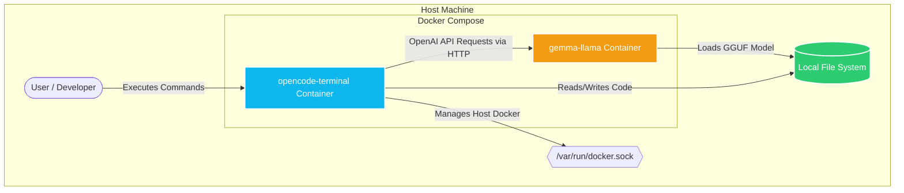

> **Complete Tech Blog & Setup Guide**  
> *Author:* Phaneesh | *Date:* May 9, 2026 | *Repository:* [Local_Ai_ON_OPENCODE](https://github.com/Phaneesh-Git/Local_Ai_ON_OPENCODE)

* * *

## Introduction
As developers increasingly rely on Large Language Models (LLMs) to enhance their workflows, privacy and offline availability have become critical concerns. Sending proprietary code or system architectures to cloud APIs isn't always viable. This post explores an elegant solution found in our local repository: building a completely self-hosted AI terminal using `Docker Compose`, `llama.cpp`, and `OpenCode`. 

By containerizing these tools, we can spin up a dedicated, privacy-first AI assistant directly on our local machines without complex dependency management.

## Project Purpose & Architecture
The repository `/git` defines a streamlined Docker Compose environment that orchestrates two primary services. Here is the high-level architecture flow:



1. **`gemma-llama`**: An inference server that runs the highly efficient Gemma-4-E4B model via `llama.cpp`. 
2. **`opencode-terminal`**: A custom terminal environment that integrates seamlessly with the AI server, providing a workspace with all necessary system mounts to act as an intelligent developer assistant.

This architecture completely isolates the AI inference engine from the local machine's host OS while allowing the terminal container controlled access via persistent volume mounts and the Docker socket.

## Code Deep Dive: The Orchestration
Let's look at how the orchestration is configured. The `docker-compose.yaml` file defines the `gemma-llama` service with optimizations specifically for local environments:

```yaml
services:
  gemma-llama:
    image: ghcr.io/ggml-org/llama.cpp:full
    container_name: gemma-llama
    command: >
      --server
      -m /models/gemma-4-E4B-it-Q4_K_M.gguf
      --port 8080
      --host 0.0.0.0
      --reasoning off
      -ngl 0
      --jinja
      -c 16384
      --parallel 1
    ports:
      - "8080:8080"
    volumes:
      - ~/gemma_models:/models
```

**Key configurations:**
- **`--server`**: Exposes the model over an OpenAI-compatible HTTP API.
- **`-m /models/...`**: Uses a quantized (Q4_K_M) version of the Gemma-4B model. Quantization is crucial here as it drastically reduces the RAM required while maintaining high output quality.
- **`-c 16384`**: Allocates a large context window (16K tokens), enabling the AI to read extensive code files and logs.
- **`volumes`**: Mounts a local directory `~/gemma_models` so you don't have to re-download gigabytes of model data every time the container spins up.

## The OpenCode Terminal Integration
The magic happens in the `opencode-terminal` container, which serves as your daily driver interface. It links to the `gemma-llama` service and mounts your local workspace:

```yaml
  opencode-terminal:
    image: opencode:usethis
    container_name: opencode-terminal
    working_dir: /work    
    volumes:
      - $HOME/.opencode:/root/.config/opencode    
      - $PWD:/work
      - /var/run/docker.sock:/var/run/docker.sock
    depends_on:
      gemma-llama:
        condition: service_healthy
```

By mounting `/var/run/docker.sock`, the AI inside the terminal can execute Docker commands, introspect other containers, and perform DevOps tasks natively. The `depends_on` block with a `service_healthy` condition guarantees that the terminal only becomes available after the `llama.cpp` server has successfully loaded the massive model file into memory.

## Key Takeaways
1. **True Privacy**: By keeping inference localized via `llama.cpp` and GGUF models, no data leaves your workstation.
2. **Reproducibility**: Docker Compose makes this setup "plug-and-play" across any Linux environment.
3. **Seamless Workflow**: Tying the AI directly into a terminal environment bridges the gap between text generation and actionable execution.

This repository is a masterclass in combining modern containerization with lightweight LLM inference. To get started, all you need is `docker compose up` followed by your terminal access command. Happy local coding!
